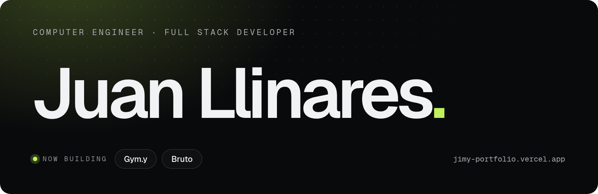

 

I build software people actually use. By day, tax management systems at gtt; the rest of the time, my own products, with one rule: easy to use and accessible to everyone.

**[Portfolio](https://jimy-portfolio.vercel.app)** · [LinkedIn](https://www.linkedin.com/in/juan-llinares-mauri/) · [jllinaresmauri@gmail.com](mailto:jllinaresmauri@gmail.com)

### Now building

**[Gym.y](https://gym-y.vercel.app/)** · in production

A training log made to be used at the gym, with your phone in one hand. It started as my own and now also serves coaches and their athletes: distraction-free logging set by set, coach mode with mesocycles, push notifications, and each user's data isolated with row-level security.

Next.js · TypeScript · Supabase · PostgreSQL · PWA · Web Push

**[Bruto](https://github.com/jimy-k4/bruto)** · open source

A brutalist, local-first task board for building projects with AI. The notes live in a file inside the project, so you and any assistant work from the same source. I use it every day to build Gym.y and my portfolio.

React · TypeScript · Vite · File System Access API · PWA · Playwright

### Earlier

- **[Particle Life](https://github.com/jimy-k4/particle-life)**: artificial life in 2D. Particles attract or repel each other following a matrix of rules, and patterns that look alive emerge. With [Edu Ruiz](https://github.com/hxst1).
- **[Memoji-my](https://github.com/jimy-k4/memoji-my)**: a memory game with new characters every match, generated with the DiceBear API.
- **[aruateam](https://github.com/hxst1/aruateam)**: website, CMS and shop for a drift team. With [Edu Ruiz](https://github.com/hxst1).

### Stack

TypeScript · React · Next.js · Node.js · C# · Oracle PL/SQL · PostgreSQL · Supabase · Tailwind CSS · Playwright

 

¿En español? [jimy-portfolio.vercel.app/es](https://jimy-portfolio.vercel.app/es)
