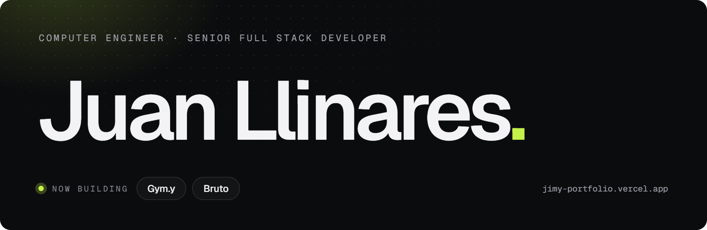

 

I build software people actually use. By day, software for tax administrations in Spain and Latin America at gtt; the rest of the time, my own products, with one rule: easy to use and accessible to everyone.

Alicante, Spain · Open to freelance work and new opportunities.

**[Portfolio](https://jimy-portfolio.vercel.app)** · [LinkedIn](https://www.linkedin.com/in/juan-llinares-mauri/) · [Ko-fi](https://ko-fi.com/jimy_k4) · [jllinaresmauri@gmail.com](mailto:jllinaresmauri@gmail.com)

### Now building

**[Gym.y](https://gym-y.vercel.app/)** · in production

A training log made to be used at the gym, with your phone in one hand. It started as my own and now also serves coaches and their athletes: distraction-free logging set by set, coach mode with mesocycles, push notifications, and each user's data isolated with row-level security.

Next.js · TypeScript · Supabase · PostgreSQL · PWA · Web Push

**[Bruto](https://github.com/jimy-k4/bruto)** · open source · [@brutoboard](https://x.com/brutoboard)

A brutalist, local-first task board for building projects with AI. It started as a tool for my work at gtt and I use it every day: the notes live in a file inside each project, so you and any assistant work from the same source. Assistants answer the notes over MCP, and a note can block or relate to one in another project.

React · TypeScript · Vite · File System Access API · MCP · PWA · Playwright

### More projects

- **[Superveil](https://jimy-portfolio.vercel.app/en#superveil)**: the traffic of all my sites on one screen: visits, who is on them right now and where people come from. Cookie-free, with the data in my own database.
- **[MCLoc](https://github.com/jimy-k4/mcloc)**: a coordinates tracker for Minecraft. Bases, portals and structures by world and dimension, on a map, with Nether conversion and tools like a pixel-perfect circle generator.
- **[aruateam](https://github.com/hxst1/aruateam)**: website, CMS and shop for a drift team. With [Edu Ruiz](https://github.com/hxst1).
- **[Particle Life](https://github.com/jimy-k4/particle-life)**: artificial life in 2D. Particles attract or repel each other following a matrix of rules, and patterns that look alive emerge. With [Edu Ruiz](https://github.com/hxst1).
- **[Memoji-my](https://github.com/jimy-k4/memoji-my)**: a memory game with new characters every match, generated with the DiceBear API.

### Stack

TypeScript · JavaScript · C# · Java · C++ · PL/SQL · React · Next.js · Vue · Nuxt · .NET · Node.js · Supabase · PostgreSQL · Oracle · Tailwind CSS · Playwright · Docker

 

¿En español? [jimy-portfolio.vercel.app/es](https://jimy-portfolio.vercel.app/es)
